# 🧠 Brain Tumor MRI Classification with CNN

<div align="center">


*Implementasi Machine Learning untuk deteksi awal tumor otak melalui analisis citra MRI menggunakan Convolutional Neural Network*

</div>

---


## 📋 Daftar Isi

- [🎯 Tujuan Proyek](#-tujuan-proyek)
- [🚀 Teknologi](#-teknologi)
- [🏗️ Arsitektur Model](#️-arsitektur-model)
- [⚙️ Cara Kerja](#️-cara-kerja)
- [📊 Hasil & Visualisasi](#-hasil--visualisasi)
- [🚀 Quick Start](#-quick-start)

  
---

## 🎯 Tujuan Proyek

Proyek ini bertujuan untuk mengembangkan sistem klasifikasi otomatis yang dapat membantu tenaga medis dalam proses deteksi awal tumor otak melalui analisis citra MRI. Dengan memanfaatkan teknologi Deep Learning, sistem ini diharapkan dapat meningkatkan efisiensi dan akurasi dalam diagnosis medis.

### ✨ Fitur Utama
- 🔍 **Deteksi Otomatis**: Klasifikasi biner tumor/non-tumor
- ⚡ **Inference Cepat**: ~112ms per prediksi
- 🎯 **Akurasi Tinggi**: Mendekati 100% pada dataset validasi
- 🖼️ **Visualisasi Interaktif**: Tampilan hasil prediksi yang informatif


---

## 🚀 Teknologi
<div align="center">
<table>
<tr>
<td align="center" width="25%">

<br><strong>Python</strong>
<br>Bahasa pemrograman utama
</td>
<td align="center" width="25%">

<br><strong>TensorFlow + Keras</strong>
<br>Framework deep learning
</td>
<td align="center" width="25%">

<br><strong>OpenCV + PIL</strong>
<br>Pemrosesan gambar
</td>
<td align="center" width="25%">

<br><strong>Matplotlib</strong>
<br>Visualisasi data
</td>
</tr>
</table>
</div>

### 📦 Dependencies
```bash
tensorflow>=2.8.0
opencv-python>=4.5.0
pillow>=8.3.0
matplotlib>=3.5.0
numpy>=1.21.0
```


---

## 🏗️ Arsitektur Model

```mermaid
graph TD
    A[Input Image 224x224x3] --> B[Conv2D: 32 filters, 3x3, ReLU]
    B --> C[MaxPooling2D: 2x2]
    C --> D[Flatten]
    D --> E[Dense: 256 units, ReLU]
    E --> F[Dropout: 0.5]
    F --> G[Output: 1 unit, Sigmoid]
    G --> H{Prediction}
    H -->|> 0.5| I[Tumor Detected 🔴]
    H -->|< 0.5| J[No Tumor 🟢]
```



### 🔧 Spesifikasi Model
- **Input Shape**: (224, 224, 3)
- **Total Parameters**: ~1.8M
- **Model Size**: ~7MB
- **Architecture**: Sequential CNN
- **Activation Functions**: ReLU, Sigmoid
- **Optimizer**: Adam
- **Loss Function**: Binary Crossentropy

---

## ⚙️ Cara Kerja

### 1. 📁 **Dataset Preparation**
```python
# Struktur dataset
dataset/
├── yes/     # 155 gambar dengan tumor
└── no/      # 98 gambar tanpa tumor
```

### 2. 🏷️ **Data Preprocessing**
- Resize gambar ke 224x224 pixels
- Normalisasi pixel values (0-1)
- Data augmentation untuk meningkatkan variasi

### 3. 🎯 **Training Process**
- **Train/Test Split**: 80:20
- **Epochs**: 10
- **Batch Size**: 32
- **Validation**: Real-time monitoring

### 4. 🔮 **Prediction Pipeline**
```python
# Contoh penggunaan
image = load_and_preprocess('sample_mri.jpg')
prediction = model.predict(image)
result = "Tumor" if prediction > 0.5 else "No Tumor"
```

---

## 📊 Hasil & Visualisasi

### 🎯 Performa Model

```
Training Results Epoch 10/10
- loss: 0.0444 - accuracy: 1.0000
- val_loss: 0.0102 - val_accuracy: 1.0000

Test Results
- test_loss: 0.4673 - test_accuracy: 0.8799
```

### 🖼️ Contoh Prediksi

<table>
<tr>
<td align="center">

<br><strong>🔴 Tumor Detected</strong>
</td>
</tr>
</table>

---

## 🚀 Quick Start

### 1. **Clone Repository**
```bash
git clone https://github.com/username/brain-tumor-classification.git
cd brain-tumor-classification
```

### 2. **Install Dependencies**
```bash
pip install -r requirements.txt
```

### 3. **Download Dataset**
```bash
# Download dari Kaggle
kaggle datasets download -d navoneel/brain-mri-images-for-brain-tumor-detection
unzip brain-mri-images-for-brain-tumor-detection.zip
```

### 4. **Train Model**
```bash
python src/train.py --epochs 10 --batch-size 32
```

### 5. **Make Prediction**
```bash
python src/predict.py --image path/to/mri_image.jpg
```

---


## 📞 Kontak & Support

<div align="center">

**Kevin Yoga Pratama**

[](https://linkedin.com/in/kevinyogapratama)
[](mailto:kevinyogapratama.str.bns@example.com)
[](https://github.com/kevinyogap)


</div>


---


<div align="center">

**🚀 Proyek Studi Independen | 2025**


</div>
